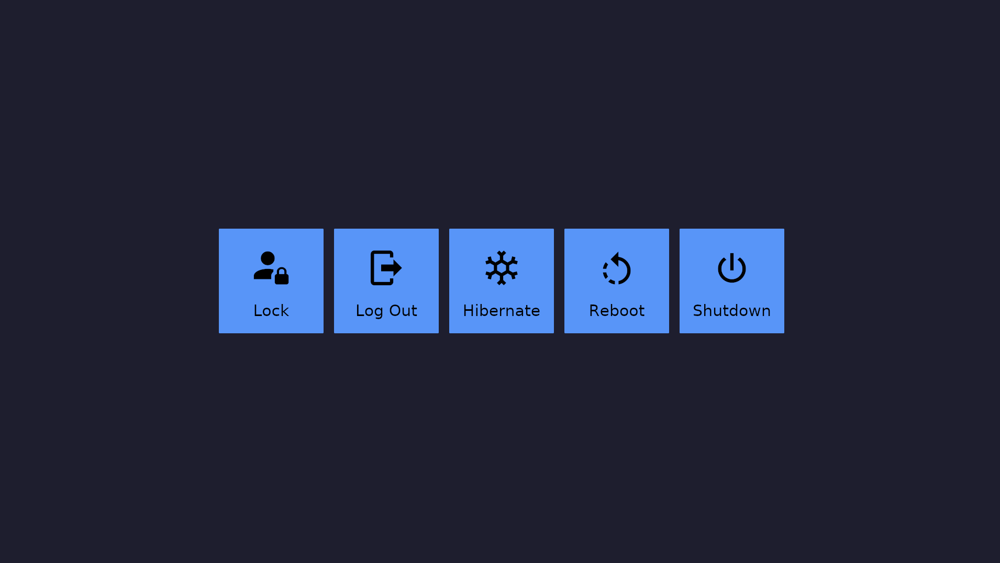

# What
Wayland power menu



# Why another one?
Existing implementations are either written in C/Zig/Nim or using GTK in Rust.
I'm a NixOS user, and gtk styling has always been a sore spot for me, so I wanted to have
something more reliable as a GUI backend (Iced in this case) and, of course, written in my
favorite language, which is Rust.

# Where Config?
I use [directorties](https://docs.rs/directories/latest/directories/) to get initial config dir, so it's either
`$XDG_CONFIG_HOME/waypwr/config.toml` or `$HOME/.config/waypwr/config.toml`.
Don't worry, the initial startup will create a default one for you!

# How Config?
- `theme` - it can be set to any one of [these](https://docs.rs/iced/latest/iced/enum.Theme.html),
except for `Custom` one, in `kebab-case`.
- actions (`lock`, `log_out`, `hibernate`, `reboot`, `shutdown`)
```toml
[actions]
log_out = {type = "dbus"} # default
lock = {type = "cmd", value = ["hyprlock"]}
```

# Can I choose config path through CLI?
Absolutely! With `--config` flag.

# What about a theme?
Same, with `--theme` flag.

# How Cancel/Exit?
Esc || 'Q'

# How work?
- GUI: [iced](https://docs.rs/iced/latest/iced/) and [iced_layershell](https://docs.rs/iced_layershell/latest/iced_layershell/)
- Actions: through DBus, leveraging [zbus](https://docs.rs/zbus/latest/zbus/) and
[logind_zbus](https://docs.rs/logind-zbus/latest/logind_zbus/)

# Plans?
Idk, my needs are simple, I just wanted something that just works and does not mess up it's styling out of nowhere
(primarily happens with gtk-based applications on NixOS for me), so I don't plan to add anything fancy, but I'm always open to suggestions and PRs!
